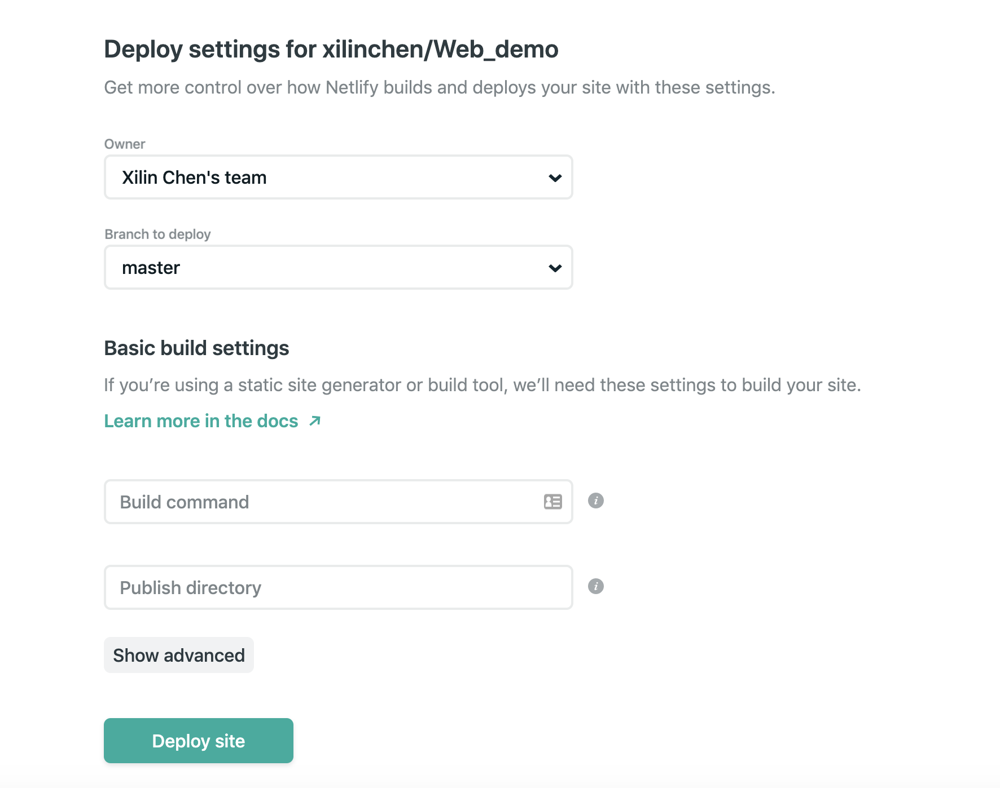

---
authors:
- admin
categories: []
date: "2019-10-12T00:00:00Z"
draft: false
featured: false
image:
  caption: ""
  focal_point: ""
lastMod: "2019-10-12T00:00:00Z"
projects: []
subtitle: Step by step tutorial to build Hugo Academic website using Rstudio
summary: Step by step tutorial to build Hugo Academic website using Rstudio
tags: []
title: How I build Hugo Academic in RStudio
---

I recently did this website using Hugo Academic theme. There are a lot resources on the internet that are very helpful. But, I still find setting up this website was not easy. In this post, I will write down a step by step tutorial using Rstudio and Github to build this website. I hope following my steps would make your experience with Hugo Academic easier! I have very little experience in building website. 


## Step 1: create a repo on github.

I personally use Gitkraken to set up repo on github. Here is how I did on gitkraken. You definitly can do it using other tools.

*notes and thoughts: Github will be your version control tool. If you use Netlify as the web host, you will push the changes to github and your website will be updated automaticly*


## Step 2: create Hugo Academic using Rstudio!

Using Rstudio to setup the website is the most convienit and straight-forward way to setup the website. Open the webiste folder through RStudio.

```r
library(blogdown)

#create a new site with the academic theme
blogdown::new_site(theme = "gcushen/hugo-academic")
```

RStudio will create all the folders and files you need for the site. Once you run the *new_site* code, you will already have a default website running!


## Get it running on Netlify

I found this is the most confusing and frastrating was to put my website on the internet. So I would recomment put your website on netlify and then make changes to your web. Below are the steps:

Step1. go to *https://www.netlify.com/* and sign up your account.

Step2. Once your are signed in, click New Site From Git


Step3. Add your website repo from Github on it. 


Step4. Then Deploy Site




## Change some parameters in files

The site is still not running yet.

1. change the url in your *config.toml* file 

```r
# The URL of your site.
# End your URL with a `/` trailing slash, e.g. `https://example.com/`.
baseurl = "https://happy-shockley-557457.netlify.com/"
```

2. Create a netlify.toml

```r
# check your huogo version
blogdown::hugo_version()
```r

```r
[build]
  publish = "public"
  command = "hugo"
[context.production.environment]
  HUGO_VERSION = "0.58.1"
  HUGO_ENV = "production"
  HUGO_ENABLEGITINFO = "true"
[context.branch-deploy.environment]
  HUGO_VERSION = "0.58.1"
```


3. Commit and push all your files in Rstudio to Github!

wow!!! Now your website should be on the internet now!!!

https://happy-shockley-557457.netlify.com/


