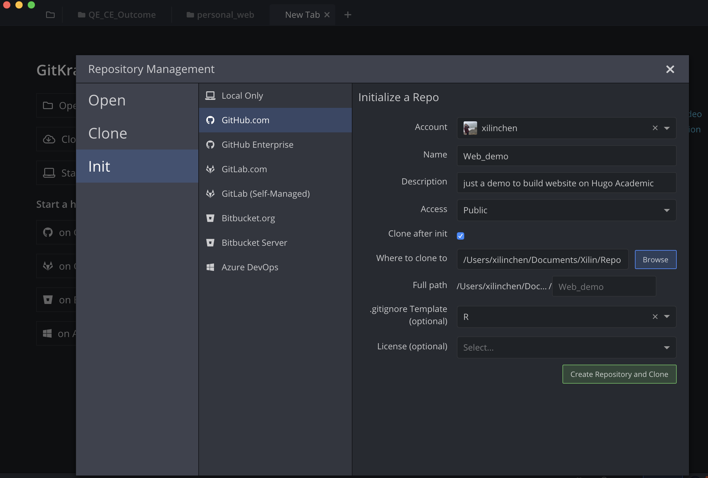

---
authors:
- admin
categories: []
date: "2019-10-12T00:00:00Z"
draft: false
featured: false
image:
  caption: ""
  focal_point: ""
lastMod: "2019-10-12T00:00:00Z"
projects: []
subtitle: Step by step tutorial to build Hugo Academic website using Rstudio
summary: Step by step tutorial to build Hugo Academic website using Rstudio
tags: []
title: Display Jupyter Notebooks with Academic
---

I recently did this website using Hugo Academic theme. There are a lot resources on the internet that are very helpful. But, I still find setting up this website was not easy. In this post, I will write down step by step tutorial using Rstudio and Github to build this website. I hope following my steps would make your experience with Hugo Academic easier! My disclosure is that I have very liitle experience in building website. 


## Step 1: create a repo on github.

I personally use Gitkraken to set up repo on github. Here is how I did on gitkraken. You definitly can do it using other tools.

*notes and thoughts: Github will be your version control tool. If you use Netlify as the web host, you will push the changes to github and your website will be updated automaticly*



## Step 2: create Hugo Academic using Rstudio!

Using Rstudio to setup the website is the most convienit and straigt forway way to setup the website.

```r
library(blogdown)
```


