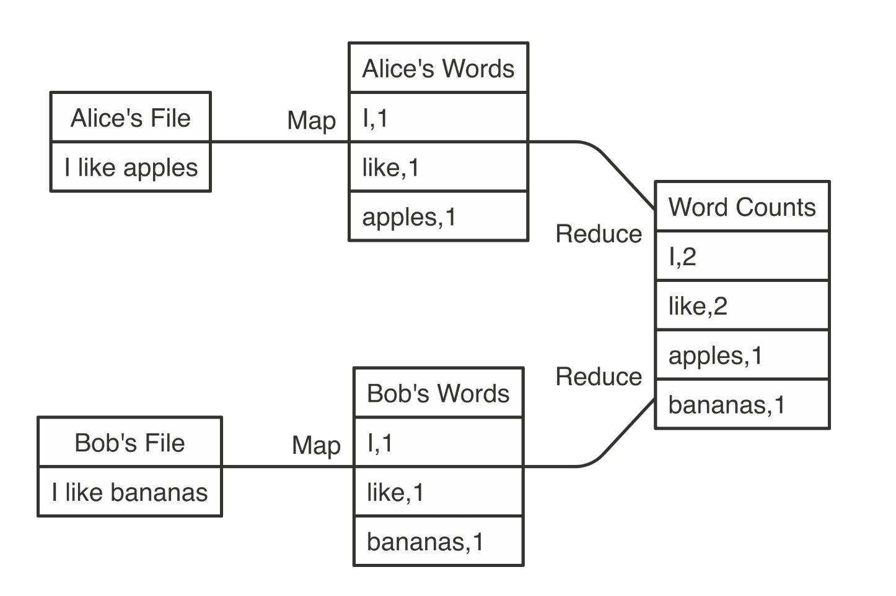

---
authors:
- admin
categories: []
date: "2019-11-09T00:00:00Z"
draft: false
featured: false
image:
  caption: ""
  focal_point: ""
lastMod: "2019-11-09T00:00:00Z"
projects: []
subtitle: Part1 introduce to Spark and connect to Spark local using R
summary: What is Apache Spark and how to connect to local spark using R
tags: []
title: Some Tips for Using Sparklyr
---

One of the challenges when using R for data processing is the limitation of memory. R read data into memory. It has a lot advantages like fast computing, but when working with big data, we would have problems that our over-sized data can't be loaded into R.

In our research team, all of the analyst colleagues using SAS to address the big data loading problem, since SAS use hard drive to read in data. For me, our group use R for analysis and I am already proficient in R. So I decided to use R to process the Medicare data.

In this post, I want to introduce a little about why using Spark (what are the advantages) and how you can implement the process I have done if you have the similar problems.

Here is a great reference book, [Mastering Apache Spark with R](https://therinspark.com/) by Javier Luraschi. If you already have basic skills in R programming, it is an easy book to read and very practical.

## HIPPA Data

Medicare data has very restricted regulation on how and where to use data. CMS data regulations are actually more strict than HIPPA in some aspects. In our data use agreement, Medicare data can only be stored in a specific network within the university and we can not put data in cloud or any distributed fashion. So all the analysis in this post happened and had to be on my local computer.

## Concepts of Apache Spark

*Sparklyr* is just a wrapper for Apache Spark. Basically, it translates the R syntax to the language Spark can read. All the big data operations happened in Spark instead of R.

### Hadoop and Spark

**Hadoop** was first introduced before Spark. But it build the foundation for the development of Spark. Hadoop uses a concept called *MapReduce*, which has two components Map and Reduce. Below is an simplified example of the concept.


*from: Mastering Apache Spark with R*

**Spark** optimize MapReduce by using in-memory data to perform data analysis which significantly increase the speed of data analysis than Hadoop on-disk storage. While Spark has great advantages in in-memory data performance, it also holds some [records](https://spark.apache.org/news/spark-wins-cloudsort-100tb-benchmark.html) in on-disk performance


## Example

I have a simple problem of filtering some procedures our research groups are interested in using MedPAR. I used my local computer as host.

### Step1: connect to spark

**JAVA Version**

When I first tried to connect to Spark using `sc <- spark_connect(master = "local")`, it gave me error regarding my Java version. So I followed the steps below to download Java 8 and point Java Home to the right version. I used brew in command line to download Java 8. Note, you might not have the java issue as I do. So, just try connecting to spark first before you download java.


```r
# sparklyr only work on java8, below is setting the java version to use in Bash
brew tap homebrew/cask-versions
brew cask install homebrew/cask-versions/adoptopenjdk8
```

Then in R, I point the downloaded version to my JAVA HOME. If you use MAC, the default downloaded java location should be the same.

```r
# set java to 8, otherwise sarklyr doesn't work
Sys.setenv(JAVA_HOME = "/Library/Java/JavaVirtualMachines/adoptopenjdk-8.jdk/Contents/Home")
sc <- spark_connect(master = "local")
```

In next post, I will introduce more about configuration for you local computer when connecting in "local" mode.

